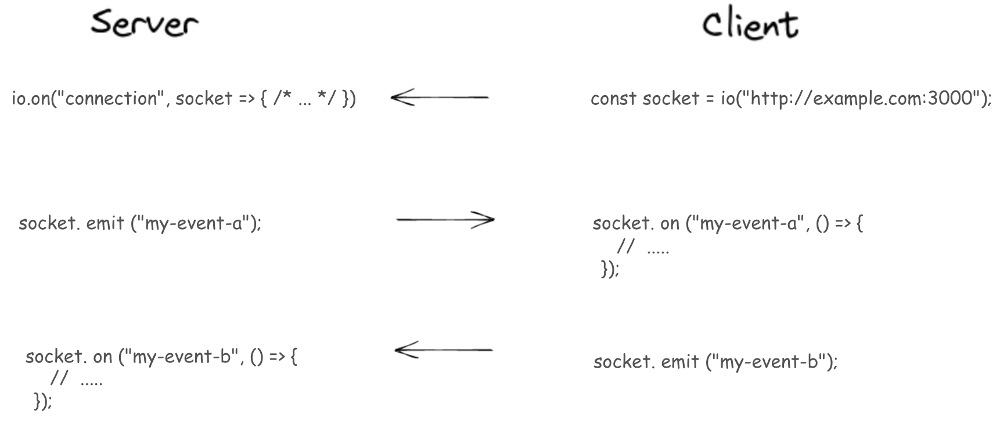

# Socket
library which enables real-time, bidirectional and event-based communication between browser (client) and server. 

# Websocket:

## Websocket API:
`WebSocket` API makes it possible to open a two-way interactive communication session between the user's browser and a server. So you can send msgs to a server and recieve responses w/out having to poll server for reply.

- When messages arrive faster than the application can process them it will either fill up the device's memory by buffering those messages, become unresponsive due to 100% CPU usage, or both.
- `WebSocketStream` interface is a Promise-based alternative to WebSocket.

# [Socket.io](https://medium.com/@brianmwambia3/introduction-to-websockets-and-socket-io-for-real-time-applications-369dcdd88e4d) 
Does: 
- Ease of Use: Socket.io abstracts away the complexity of directly using WebSockets, offering a simpler API.
- Cross-Browser Compatibility: It handles browser-specific quirks and fallbacks, ensuring compatibility across different browsers.
- Automatic Reconnection: Socket.io can automatically reconnect if the connection is lost.
- Rooms and Namespaces: Provides features to group connections into rooms or namespaces for more structured communication.


# Basic Setup:

```js
const express = require('express');
const http = require('http');
const { Server } = require('socket.io');

const app = express();
const server = http.createServer(app);
const io = new Server(server);

// Serve a simple message on the root route
app.get('/', (req, res) => {
  res.send('WebSocket server is running.');
});

// Handle WebSocket connections
io.on('connection', (socket) => {
  console.log('A user connected:', socket.id);

  // Handle incoming messages
  socket.on('message', (msg) => {
    console.log('Received message:', msg);
    // Broadcast message to all connected clients
    io.emit('message', msg);
  });

  // Handle disconnection
  socket.on('disconnect', () => {
    console.log('User disconnected:', socket.id);
  });
});

// Start the server
const PORT = process.env.PORT || 3000;
server.listen(PORT, () => {
  console.log(`Server is running on http://localhost:${PORT}`);
});

```
**Basics:**
Express and HTTP Server: We use Express to handle HTTP requests and create an HTTP server instance that Socket.io can use for WebSocket communication.
Socket.io Server: A new Socket.io server instance is created by passing the HTTP server. This instance listens for WebSocket connections.
**Key:**
Handling Connections: When a new client connects, the `connection` event is triggered. We log the connection and set up listeners for incoming `messages` and `disconnections`.
Broadcasting Messages: Received messages are broadcast to all connected clients using the `io.emit` method.
Handling Disconnections: The `disconnect` event is used to handle when a user disconnects from the server.


